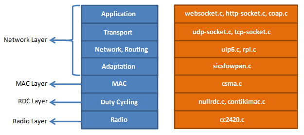

# Glossy Radio Communication in Wireless Sensor Network

## Glossy

[Ferrari, Federico, et al. "Efficient network flooding and time synchronization with glossy." Information Processing in Sensor Networks (IPSN), 2011 10th International Conference on. IEEE, 2011.](https://ieeexplore.ieee.org/abstract/document/5779066/)

Glossy is a network flooding architecture in WSN(Wireless Sensor Network). Glossy uses interferences constructively to increase the reliability, and makes nodes to be synchronized  implicitly.

## Communication in WSN

a network broadcasting(by flooding) is very inefficient in WSN because of "Broadcast storm", "Destructive Interference". Even though we already know the broadcasting cost is high, why should we use the broadcasting in WSN?

Assume that you don't know the network topology, and you want to send a packet to all nodes in WSN. the one way to make it is that a initiator sends a flooding packet to the 1st hop nodes. after the sending, the 1st hop receivers resend the flooding packet to near nodes.  If this process is repeated continuously in WSN, the last hop nodes will receive the flooding packet.

In this way, there are problems.
First, interferences among radio signals. when many nodes send the signal, there will be interferences among signals. It causes the signals to disappear.
Second, redundant resending. the packets resented by near nodes will arrive at the nodes which send the packets to the near nodes, and resend the packets to near nodes again.

To solve these problems and synchronize nodes, we can use the Glossy architecture. One of the point to implement Glossy is to make constructive interferences. If the receiving nodes send the packet at the exact same time, there will be constructive interferences. Since every chip is sent every 0.5us In the IEEE 802.15.4 scheme, the receiving nodes have to send the flooding packet within 0.5us.
The other point is to put a relay counter into the flooding packet for indicating how many times the packet is sent. By using this counter, the receiving node can calculate the time when a initiator starts flooding. this calculated time is called as "Reference time". All nodes in WSN can be synchronized to the initiator by using reference time. Theses two points are the main idea of Glossy.

## Contiki & Sensortag
### Contiki Network Stack

This is the contiki network stack. To implement the Glossy communication, the network stack must be adjusted. The modified network stack codes are uploaded.

### CC2650 Reference Manual
[cc2650 manual](http://www.ti.com/lit/ug/swcu117h/swcu117h.pdf)

In the reference manual, there are the radio section and the clock section. These two section is analyzed for meeting the requirements of Glossy.

### Checking the performance
[Sensortag Schematic](./sensortag.pdf)
[Devpack Schematic](./devpack.pdf)

Based on these two schematic, the signal can be logged. With the multiple sensors, the signal should be captured within 5us for making the constructive interference; the 5us is based on the radio module of Sensortag.

## Demo Video
 

## Project History
In my project, I tried to implement Glossy. I used TI Sensortag - http://www.ti.com/tool/TIDC-CC2650STK-SENSORTAG#Technical%20Documents. I also used Contiki OS for this project - http://www.dunkels.com/adam/dunkels04contiki.pdf.

In conclusion, I realized that it is impossible to implement Glossy in TI Sensortag. To make constructive interferences which are the main idea of Glossy, We have to make nodes retransmit the flooding packets within 0.5us in IEEE 802.15.4 scheme. What I found is that there is already a jitter from the radio over 0.5us, when the nodes receive a flooding packet. Moreover, since it is not allowed to control a radio directly in TI Sensortag, It is impossible to implement  Glossy in this node without the firmware information of Sensortag. However, Texas Instrument does not provide their firmware information.

To implement Glossy in TI Sensortag with Contiki OS, I started from the analysis of the Contiki network stack and how to transmit the packet. - http://anrg.usc.edu/contiki/index.php/Network_Stack
I selected the minimized network stack, and got into the deep core codes to analyze the transmitting process. After this step, I implemented the application working in the radio core file for my Glossy phase. I checked the jitter by a logic analyzer.

At the first version application, the jitter was more than 1ms. Since it is too big to make constructive interferences, I minimized sending process codes. After the process, a jitter recorded at a just receiving function was 0.6us(the first jitter), and the other  jitter recorded at the end of Glossy phase was 3us(the second jitter). the 3us jitter after resending doesn't make sense for constructive interferences. I found the technical reference manual. - http://www.ti.com/lit/ug/swcu117f/swcu117f.pdf Following this document, I studied the radio of TI Sensortag, and I tried to send commands to control radio directly and reconfigure the radio settings. Sending commands wasn't helpful for reducing the jitter, but reconfiguration worked. Finally, I got the first jitter(0.6us), and the second jitter(0.6us). Even though I reduced the jitter by everything I can do in TI Sensortag, I failed to reduce the jitter within 0.5us. I think it is impossible to make it with the black box radio(because I can't know the inside of the radio module).

It was my first project with Contiki OS and small nodes. I failed, but I learned much from this project. Before the project, I think the detailed analysis of the device is necessary for the successful project.