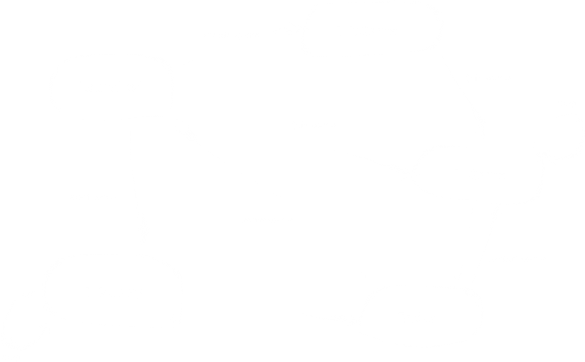
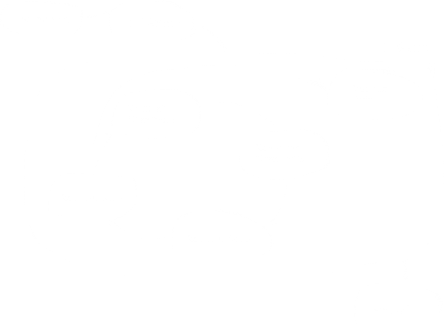

[back](../../sc2ai){: .btn.btn-default}

# StarCraft 2 API

[SC2 API Github link](https://github.com/Blizzard/s2client-api){: target="_blank"}

This Github repository is SC2 API. SC2 API is a protobuf based on protocols using websockets as the connection layer. Therefore, SC2 API is accessed through the web sockets. SC2 API communicates with SC2 game through the web socket URL. The whole communications between SC2 API and SC2 gmae are done by "request" and "response". 

Each request is usually paired with each response.

## Protocols

The game state is in the status field of every response. The possible states are introduced as a state machine diagram.

SC2 API provides the access to the game state observation and the unit control. Usually, at InGame state, request and response are paired. request normally is the order for controlling units and for getting a state observation, and respond is the state caused by request. On the other hand, at InReplay state, there is no request for controlling units, but request for getting a state observation. The game and replay are processed by steps. The API provides two game speed modes; a single step mode and a realtime mode. 

These are InGame and InReplay diagrams. 

For playing two bots against each other, what I have to do is to launch two instances of the API, and synchronize them. 

## Interface
The basic model of the API and the game is observation and action model. The action is the request from API, and the observation is from the game.
There are four interfaces for the observation. 
- Raw data interface : direct access to the game state and control for scripted AIs.
- Featured layer interface : the game states are provided as featured layers for machine learning AIs.
- Rendered interface : the real pixel image of game is used as a game state.
- Scored interface : not image information, but score information about the game. 

Until now, the raw data interface and the scored interface are used for scripted AIs. The rendered interface and the scored interface are for machine learning AIs. The scored interface are used to evaluate the current status of the game. With this information, the actions are placed by SC2 API.

## The Relation between SC2 Protobuf and API
The relationship between SC2 API and Protobuf is that SC2 API includes Protobuf for its communication. In this repository, Protobuf is also included.Therefore, the request and response between SC2 API and game have protocols defined by Protobuf.

## Operating System
At the very first time, I tried to set the API up on my Linux machine. However, I don't recommend this. For the machine learning based AI, maybe it's more efficient to install SC2 API on a Linux machine for training. The released SC2 for linux is a headless version. It means that SC2 dosen't include graphic stuff, so it is not possible to check the game screen. Even though it's headless, SC2 can be used for AI to play against other AIs or human players. Therefore, I don't recommend using Linux machine at the very first step.