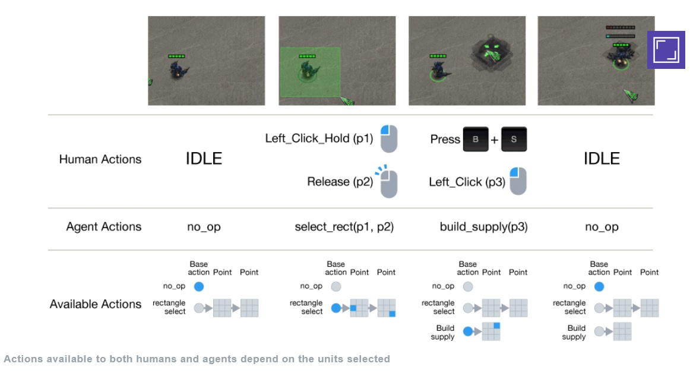

[back](../sc2ai){: .btn.btn-default}

# DeepMind and Blizzard open StarCraft II as an AI research environment

[News link](https://deepmind.com/blog/deepmind-and-blizzard-open-starcraft-ii-ai-research-environment/){: target="_blank"}

DeepMind is collaborating with Blizzard Entertainment. They released Starcraft II research environment. The environmnet includes these things.

- PySC2 which is an DeepMind's toolset
- A series of simple RL mini-games 
- A joint paper outlining the environment

Starcraft 2 has quite big complexity. As a example, the action space is quite big.

To build a building, the player should use Terran SCV, Protoss Probe, or Zerg Drone. The agent do tasks to conduct the players action. Available actions are dependent to the unit the player selected. 

As the example showed, Starcraft 2 is too complex to be tackled. In PySC2, the DeepMind toolset, the game is broken into feature layers. 

From this feature layers, the researcher can get various status of the game, and the AI player can make more reasonable decisions by using this game status.
Moreover, they also provide some mini-games to check the specific task's performance. With this platform, the researcher can tackle each component of games, and test it. 