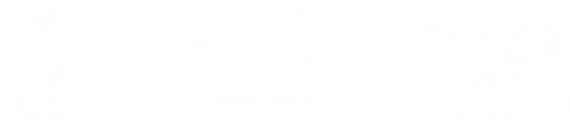

[back](../sc2ai){: .btn.btn-default}

# Google Protocol Buffer

[Protocol buffer link](https://developers.google.com/protocol-buffers/){: target="_blank"}

During analyzing SC2 API by Blizzard, I found there are bunch of .proto files. Moreover, Blizzard also has separated github repository ["sclient-proto"](https://github.com/Blizzard/s2client-proto){: target="_blank"} which is the protocol definitions for communicating with SC2. To fully understand SC2 API, I realize I should know what the protocol files are. Protocol Buffer is released by Google, and it seems to be really comfortable to developers.

## What Protocol Buffer Is
Protocol Buffer is a extensible mechanism which is language and platform neutral. To use Protocol Buffer, firstly how your data to be structured is defined once. After this, the Protocol Buffer compiler generates special generated source code to read/write the structured data you define with various data streams and various languages. 

the .proto file is definitions of protocol buffer messages. the message is a small logical record of information consisting of name-value pairs. In addition to the .proto file, it is possible to add new fields without breaking backward compatibility, since the old binary just ignore the new fields. .proto files have three fields. These are the [field rules](https://developers.google.com/protocol-buffers/docs/proto#simple){: target="_blank"} of Protocol Buffer. 

- Required field : a message must have only one of this field.
- Obtional field : a message can have zero or one of this field.
- Repeated field : a message can have any number of times(including zero) of this field.

## The Architecture of Protocol Buffer and Steps to Use
The overview of Protocol Buffer is like this:

The steps for using Protocol Buffer
1. Define message formats in .proto files
1. Use the protocol buffer compiler to make access classes
1. Use the each language protocol API to read/wirte messages