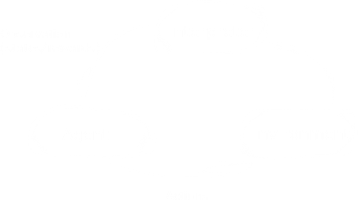

[back](../csmain){: .btn.btn-default}
[Q-Learning](../qLearning){: .btn.btn-default}

# Reinforcement Learning Basic

I refer these pages;
- [Reinforcement Learning Wiki](https://en.wikipedia.org/wiki/Reinforcement_learning){: target="_blank"}
- [Dynamic Programming Wiki](https://en.wikipedia.org/wiki/Dynamic_programming){: target="_blank"}

## The Loadmap of Reinforcement Learning
Machine Learning
- Reinforcement Learning : making agents select the optimal actions
	- Exporation method : \\(\epsilon-greedy\\)
	- To find the optimal policy
		- Brute force
			- Direct policy search : gradient descent
			- Value functions
				- State-value function : evaluate a given policy from a state by using the expected return
				- Action-value function : evaluate available actions with the expected return, to find the optimal action-value function;
					- Value iteration : [Q-Learning](./qLearning)
					- Policy iteration 
						- Policy evaluation : Monte Calo methods
						- Policy improvent : Greedy, Temporal Difference, and Function appoximation methods

 
 

## What The Reinforcement Learnig Is
Reinforcement learning makes the software agents take the action maximizing cumulative rewards. RL is also called "approximate dynamic programming". To fully understand this, I also understand what the Dynamic Programming.

### Dynamic Programming and The Realtionship Between Reinforcement Learning and Dynamic Programming
Dynamic programming solves a complex problem by breaking the problem into a collection of simple sub-problems. solving the sub-problems is done once, and the solutions are indexed and stored. When the same sub-problems occur, the saved solutions are used. Dynamic programming algorithms can be used for optimization since the previous solved problems' solutions can be combined to get the bset solution.

With the concept of dynamic programming, let's consider the meaning of "approximate dynamic programmnig". In reinforcement learning, the problem is to maximize the reward, and the dynamic proramming is used to tackle this problem. Since approximation is needed for improving efficiency of reinforcement learning, 'approximate' is added to the dynamic programming.

### Markov Decision Process
In machine learning, the environment is usually formulated as a Markov decision process(MDP), MDP provides a mathematical framework for modeling decision making when outcomes are partly random and partly under the control of a decision maker.
With MDP, the basic reinforcement learnig is modeled like this;

Reinforcement learning is proper for the problems about a long-term versus short-term reward trade-off. To improve the performance of reinforcement learning, the use of samples and the use of function approximation for large environments are important. 

\\(S : a \  set \  of \  environment \  and \  agent \  states\\)

\\(A : a \  set \  of \  actions \  of \  the \  agent\\)

\\(P_{a}(s, s') = P_{r}(S_{t+1}=s' \mid s_{t}=s, a_{t}=a) : Probability \  of\ transition \  from \  state \  s \  to \  state \  s'\\)	

\\(R_{a}(s, s') : immediate\ reward\ after\ transition\ from\ s\ to\ s'\\)

\\(t : each \  time \  step\\)

\\(o_{t} : observation \  at \  t\\)

\\(a_{t} : action \  at \  t\\)

\\(s_{t} : state \  at \  t\\)

\\(r_{t} : reward \  at \  t\\)

\\(transition(s_{t}, a_{t}, s_{t+1})\\)
 
 
## Exploration

Simple exploration methods are the most practical. One of the simple methods is \\(\epsilon-greedy\\), the agent chooses the postulated action which will have the best long-term effect with the probability \\(1 - \epsilon\\). Therefore, \\(0 < \epsilon < 1\\) is te tuning factor. Otherwise, the agent chooses an action uniformly at random. 
 
 
## Algorithm for control learning
### Criterion of optimality
- Policy

\\(\pi : S \times A \to [0, 1]\\)

\\(\pi(a \mid s) = P(a_{t}=a \mid s_{t}=s)\\)

Policy map gives the probability of taking action in state s. This means that the selected action in state s is determined by the policy.

- State-value function 
The state-value function \\(V_{\pi}(s)\\) is determined by the expected return with the state s and the policiy \\(\pi\\). 

\\(V_{\pi}(s) = E[R] = E[\sum_{t=0}^{\infty}\gamma^{t}r_{t} \mid s_{0}=s]\\)

\\(R = \sum_{t=0}^{\infty}\gamma^{t}r_{t} : Return\\)

- Action-value function

### Brute force
The brute force approach involves two steps;
- For each possible policy, sample returns while following each policy
- Chooes the policy with the largest expected return

This may have some troubles related to the large number of policies and the large variance of the returns. The troubles can b relieved by allowing the sample from one policy to influence the estimates made for others. This means that each policy can have an effect on the other policies. This can be achieved by "value function estimation" and "direct policy search".

A. Value function

Value function finds a policy maximizing the return by maintaining a set of estimates of expected returns. The optimal policy achieves the best expected return from any initial state, and can be found among the stationary policies. 
The value of a policy is defined as

\\(V^{\pi}(s) = E[R|s,\pi], R : the \  random \  return \  with \  following \  the \  policy\  \pi \  from \  the \  initial \  state \  s\\)
\\(V^*(s) = {max}_{\pi}V^\pi(s) : the \  maximum \  possible \  value \  of \  the \  policy\\) 

More than the state-value function, action-values are useful. 

\\(Q^\pi(s, a) = E[R \mid s, a, \pi], R : \  the \  random \  return \  with \  fist \  taking \  action \  a\\)
\\(Q^* : the \  optimal \  action-value \  function\\)

To get the optimal action-value function, value iteration and policy iteration are used. Both compute a sequence of action-value function Q, and converge to the optimal action-value function with function approximation techniques.

- Policy Iteration : consists of policy evaluation and policy improvement.
	- Monte Calo Methods : Monte Calo Method is used for policy evaluation. Given a stationary, deterministic policy, it computes the function values of the action-value function for all state-action pairs(s, a). With the calculations, it computes the estimation of Q.
	- For policy improvement, greedy policy methods have many problems. To overcome the problems, Temporal Difference(TD) and Function Approximation methods are used. The function approximation method maps a finite-dimensinal vector to each state-action pair with some weights. 
\\(Q(s,a) = \sum_{i=1}^d\theta_i\phi_i(s, a), \  \theta:  \  weight, \  \phi(s, a): \  the \  vector \  mapped \  to \  state-action \  pair\\)

- Value Iteratin : refer [Q-learning]("https://en.wikipedia.org/wiki/Q-learning"){: target="_blank"}

B. Direct policy search

The two apporaches available are gradient-based and gradient-free methods. This methods may get struck in local optima. Since they uses the gradient ascent, it is mathematically natural.
 
 
## Conclusion
The basic reinforcement learning is modeled by MDP. The policy is really important since an action is selected from a state s based on the policy. Brute force methods are used to get the optimal policy. Since the brute force methods have some problems, value function estimation and direct policy search are used to overcome the problems.

There are two value functions; State-value function and Action-value function. For optimal Action-value function, Value iteration and Policy iteration are used. Policy iteration consists of the policy evaluation(Monte Calo Methods) and improvement(TD, Function Approximation). For the value iteration, refer Q-Learning. Direct policy search has restriction about the local optima. 

These days, end-to-end reinforcement learning or deep reinforcement larning is getting attention. 