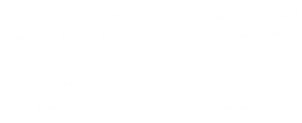

[back](../csmain){: .btn.btn-default} [Basic2](./docker2){: .btn.btn-default}

# Docker Basic1

[Docker Official Website](https://www.docker.com/){: target="_blank"}

## Motivation
After research fellowship in UC, Irvine, I realize that the team work is not easy. These days, there are bunch of tools for making team wrok easier. Among them, Docker is a quite nice tool. So, I introduce Docker and the basic way to set up the environment for team work.

## Why Do We Need Docker?
Follwing the official webiste, Docker is for the true independence between applications and infrastructure. Why we need Docker? I'd like to say that it's for the independence of pure computing power from the environment. Assume that we're the back-end developers. The technoligies are extreamly fast, and there are tons of updates for our server. As we know, every update for OS is quite annoying and sometimes risky, because the changes on OS have an effect on the applications. Further, assume that we're the front-end devlopers. When we develop and deploy the applications, we always consider the user's environment. We use Docker, because the computing power is usually affected by the environment.

## What Docker And The Container Are
Docker is a container platform to address every applications. To understand the concept of Docker, it is necessary to understand what the container is. The official website provides the basic explanations of Docker and the container. The container is a standardized unit of software. So, we can put software into standardized units, the containers, for flexibility of development, shipment, and deployment. The container includes all resources for running the program such as codes, tools, libraries, and settings. Therefore the contained application always run same regardless of the environment. 

## The Difference Docker And Virtual Machine
This difference can be explained by the level of abstraction. In short, Docker and VM have similar concepts, but they are on different level of abstration. 

VM is between infrastructure and OS by the hypervisor. Therefore, it requires more resources than Docker. If we need the independence for the application, it is more effective to use Docker than VM. 

## Team Work Environment
At the very first step of a team project, it is reasonable to set up Docker. After that process, all team members can work irrespective of their infrastructure. With Docker, using git and github is recommendable for the code-level flexibility.