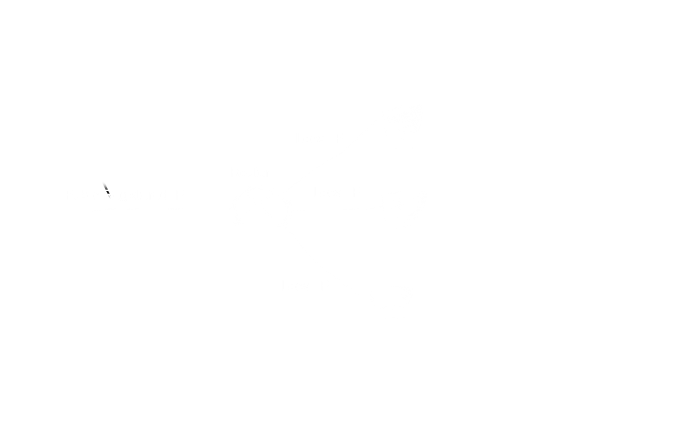
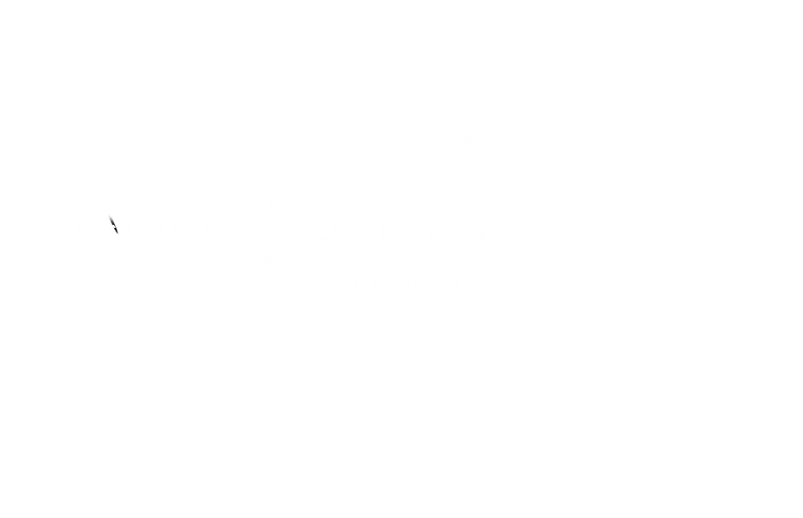

[back](../csmain){: .btn.btn-default}

# Setup My Server

After research fellowship in UC, Irvine, I realized that I need my own server for extending my computing power. In this article, I explain my Internet environment, and the process for setting up my own server.

## The Internet Environment

I have a contract with a telecompany in South Korea. Therefore, I have only one public registered IP. With the public registered IP, I also use a router for using the internet with many devices. 

## The Processes for Setting up

There are processes for setting up the server.
- Figure out the public registered IP
- Set Port Forwarding 
- Set a server computer

Many websites provide the functionality checking the public registered IP, or it's possible to check the IP at the router management page, since the router address is the public registered address.

After checking the IP, I have to set a port forwarding option of my router. 
> port forwarding or port mapping is an application of network address translation (NAT) that redirects a communication request from one address and port number combination to another while the packets are traversing a network gateway, such as a router or firewall. This technique is most commonly used to make services on a host residing on a protected or masqueraded (internal) network available to hosts on the opposite side of the gateway (external network), by remapping the destination IP address and port number of the communication to an internal host.
https://en.wikipedia.org/wiki/Port_forwarding

If I want to make a SSH server, I have to set SSH port forwarding. After this, I should set my computer for making the server listen SSH connections from outside. In my case, I installed Ubuntu on my server computer, and installed SSH. When I access to my SSH serve, I use the public registered IP and the SSH port number. 